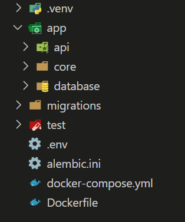

# ⚡ _**FastGen**_

Start FastAPI Projects in Lightning Speed

Built With **Typer** To Help With <span style="color:green">**FastAPI**</span>.

## 👀 **Take A Look**

this is a glanc of the project structure you will have once you use **FastGen**



## ✨ **Installation**

```console
$ python -m pip install fastgen
```

**Usage**:

```console
$ fastgen [OPTIONS] COMMAND [ARGS]...
```

**Options**:

- `--install-completion`: Install completion for the current shell.
- `--show-completion`: Show completion for the current shell, to copy it or customize the installation.
- `--help`: Show this message and exit.

**Commands**:

- `info`
- `new`

## `fastgen info`

**Usage**:

```console
$ fastgen info [OPTIONS]
```

**Options**:

- `--help`: Show this message and exit.

## `fastgen new`

**Usage**:

```console
$ fastgen new [OPTIONS] ⭐ Project Name
```

**Arguments**:

- `⭐ Project Name`: [required]

**Options**:

- `--dir 📁 Directory Path`
- `--package-manager 📦 Package Manager`: [default: pip]
  ( Options are pip , poetry )
- `--migrations / --no-migrations`: [default: False]
- `--docker / --no-docker`: [default: False]
- `--testing / --no-testing`: [default: False]
- `--database 📅 Database`: [default: postgresql] ( Options are postgresql,mysql,sqlite )
- `--help`: Show this message and exit.

## 🪲 **Encountered A Problem !**

feel free to open an issue discussing the problem you faced

## 🤝🏻 **Contributing**

please refer to [Contribution Guide](./CONTRIBUTING.md)
